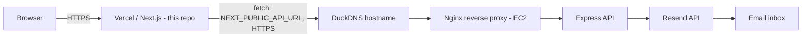

# Sheharzad Salahuddin — Portfolio

A Stranger-Things-themed personal portfolio built with Next.js, deployed on Vercel, with a live contact form backed by a self-hosted production API.

## Live

**https://sheharzad-portfolio.vercel.app**

## Architecture

This repo is the frontend only. It talks to a separately-hosted backend for the contact form — full backend/infrastructure details (EC2, nginx, systemd, CI/CD, HTTPS) live in the [`portfolio-api`](https://github.com/sheharzad-developer/portfolio-api) repo.



Deployment for this repo is separate from the backend's CI/CD pipeline: Vercel's native GitHub integration builds and deploys automatically on every push to `main`. There is no custom GitHub Actions workflow here.

## Tech Stack

| Layer | Technology |
|---|---|
| Framework | Next.js 16 (App Router), React 19, TypeScript |
| Styling | Tailwind CSS 4 |
| Animation | Framer Motion, GSAP |
| 3D | React Three Fiber, Drei, Three.js |
| Particles | tsparticles |
| Icons | react-icons |
| Hosting | Vercel |

## Frontend

Key sections/components (in `app/components/`):

| Component | Purpose |
|---|---|
| `Hero.jsx` | Landing/intro section |
| `AboutContact.jsx` | About section + the live contact form (calls the backend API) |
| `Skills.jsx` / `SkillsGrid.jsx` | Skills display |
| `Projects.jsx` | Project showcase |
| `Certifications.jsx` | Certifications list |
| `GitHubActivity.jsx` | GitHub activity display |
| `IntroAnimation.jsx` | Full-screen intro sequence played on load |
| `StrangerThingsBackground.jsx`, `FallingAshes.jsx`, `LightningFlash.jsx`, `Demogorgon*.jsx` | Decorative theme effects |
| `SectionWrapper.jsx` | Scroll-triggered fade-in wrapper (`framer-motion` `whileInView`) used around each page section |

Additional routes: `app/resume/page.tsx`, `app/articles/page.tsx`.

**Known minor issue:** deep-linking directly to `/#contact` can render the contact section blank — it races against the intro animation and the scroll-triggered fade-in animation on `SectionWrapper`/`AboutContact`. Normal navigation (landing on the homepage, then scrolling) works correctly. Not yet fixed.

## Backend / API

The contact form calls a separately-hosted Express API — see [`portfolio-api`](https://github.com/sheharzad-developer/portfolio-api) for the full backend, infrastructure, and CI/CD documentation. Relevant endpoint from this repo's perspective:

```
POST {NEXT_PUBLIC_API_URL}/api/contact
Body: { name, email, message }
```

## CORS / Security

The backend's CORS policy is locked to this site's exact production origin (`https://sheharzad-portfolio.vercel.app`, no trailing slash). Because this site is served over HTTPS, the backend must also be served over HTTPS — calling a plain-HTTP API from an HTTPS page is blocked by browsers as mixed content, regardless of CORS. This is why the backend is fronted by nginx with a Let's Encrypt certificate rather than the plain EC2 IP over HTTP.

## Environment Variables

| Variable | Required | Description |
|---|---|---|
| `NEXT_PUBLIC_API_URL` | Yes | Base URL of the backend API (e.g. `https://sheharzad-portfolio.duckdns.org`). Exposed to the browser at build time (Next.js `NEXT_PUBLIC_*` convention) — set in Vercel's Environment Variables for Production, and in a local `.env.local` for development. |

## Deployment Flow

```
git push origin main
  → Vercel's GitHub integration detects the push
  → Next.js production build
  → Deployed automatically to https://sheharzad-portfolio.vercel.app
```

No manual deployment steps; no custom CI/CD workflow in this repo.

## Problems Encountered & Solutions

- **Mixed content blocking**: the live HTTPS site couldn't call the backend while it was still plain HTTP — browsers silently block this. Resolved by adding HTTPS to the backend (see `portfolio-api` repo for how).
- **CORS trailing slash**: the backend's `origin` value initially had a trailing slash and never matched this site's actual `Origin` header, silently blocking every request. Fixed on the backend.
- **Contact form rendering blank on deep link**: navigating directly to `/#contact` can land before the intro animation/scroll-triggered fade-in resolves, making the form appear missing. Normal scroll navigation is unaffected; this is a known, unfixed minor issue.

## Testing / Verification

A real submission through the live contact form (`https://sheharzad-portfolio.vercel.app`, normal navigation, not the `#contact` deep link) was confirmed to reach the backend and deliver an email to the site owner's inbox — full end-to-end verification, not just isolated component testing.

## Project Structure

```
sheharzadstrangerthings-portfolio/
├── app/
│   ├── components/       # All UI sections/components (see table above)
│   ├── articles/page.tsx
│   ├── resume/page.tsx
│   ├── layout.tsx
│   ├── page.tsx           # Assembles all sections
│   └── globals.css
├── public/
├── package.json
└── README.md
```

## Local Development

```bash
git clone https://github.com/sheharzad-developer/sheharzadstrangerthings-portfolio.git
cd sheharzadstrangerthings-portfolio
npm install

# Create .env.local with:
# NEXT_PUBLIC_API_URL=https://sheharzad-portfolio.duckdns.org
# (or your own locally-running backend, e.g. http://127.0.0.1:3000)

npm run dev
# http://localhost:3000
```

## Production Deployment Overview

Hosted on Vercel with automatic builds and deploys on every push to `main`. The only manual configuration required is `NEXT_PUBLIC_API_URL` in Vercel's Environment Variables, pointing at the production backend. The backend itself (EC2, nginx, HTTPS, CI/CD) is documented separately in the [`portfolio-api`](https://github.com/sheharzad-developer/portfolio-api) repo.

## Lessons Learned

- **Mixed content is a hard browser rule, not a CORS setting** — an HTTPS page cannot call a plain-HTTP API no matter how CORS is configured; the backend itself needs TLS.
- **`NEXT_PUBLIC_*` env vars are baked in at build time** — changing them in Vercel requires a redeploy to take effect, and local development needs its own `.env.local` since Vercel's dashboard values don't apply to `next dev`.
- **Scroll-triggered animations and deep links can race each other** — `whileInView`-style animations that assume a normal top-down scroll can fail to trigger correctly when the page loads already scrolled to a URL fragment.
- **CORS origin matching is exact-string, not fuzzy** — a trailing slash, protocol mismatch, or subdomain difference is a silent full block, not a partial failure.
- **End-to-end verification (real form submission → real email) is what actually proves the integration works** — testing the frontend and backend in isolation would not have caught a mismatched CORS origin or a mixed-content block.
